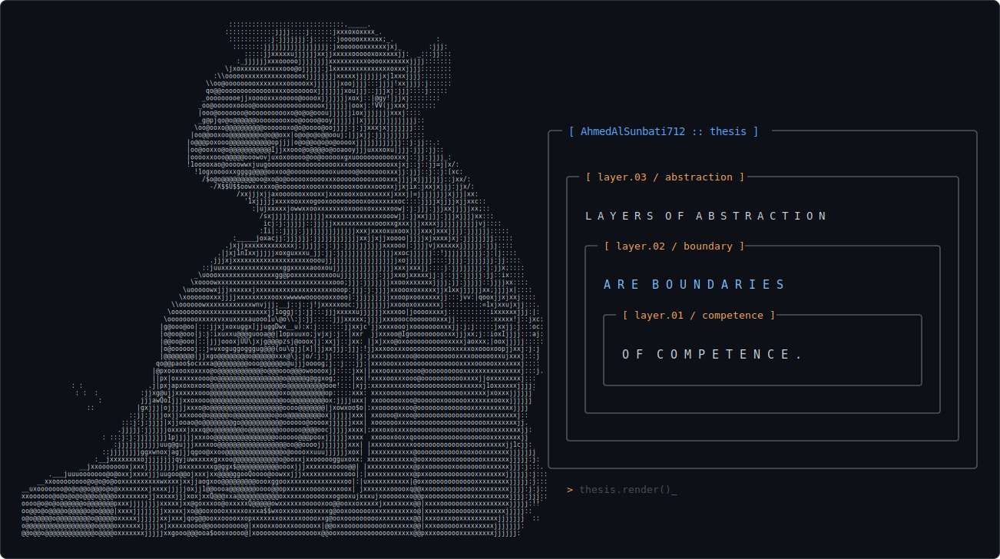

Layers of abstraction are boundaries of competence.

## Currently working on

- **[StoneleafDB](https://github.com/AhmedAlSunbati712/StoneleafDB):** A crash-safe, transactional, distributed, ordered key-value store.
- **ForkVFS:** A forkable distributed block-storage service. Writes are durable on a quorum of storage nodes. Writes to forks use copy-on-write. *(Design phase.)*

## Currently reading

- Petrov, A. (2019). *Database Internals: A Deep Dive into How Distributed Data Systems Work.* O'Reilly Media.
- Kleppmann, M. (2017). *Designing Data-Intensive Applications: The Big Ideas Behind Reliable, Scalable, and Maintainable Systems.* O'Reilly Media.
- Jeffery, T. (2021). *Distributed Services with Go: Your Guide to Reliable, Scalable, and Maintainable Systems.* Pragmatic Bookshelf.
